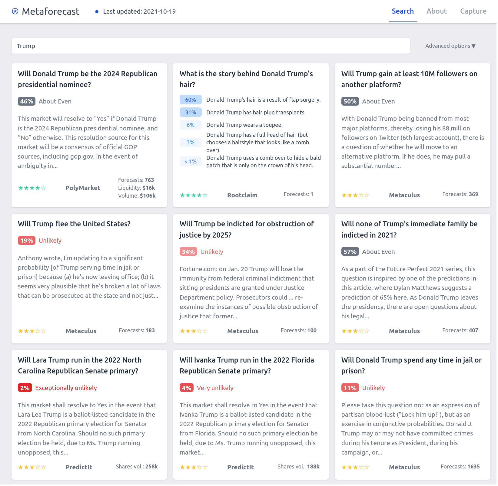
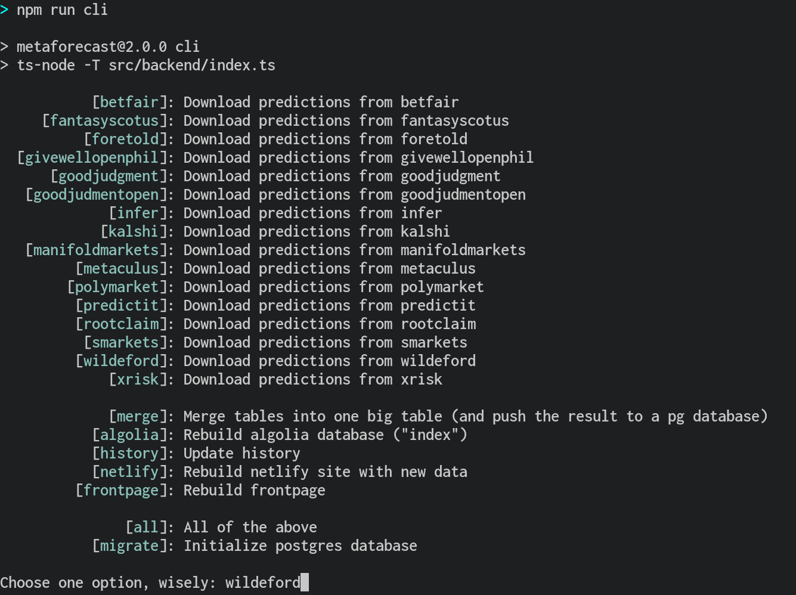

## Move to Squiggle monorepo

**This repository is deprecated.**

To make things easier to maintain by [QURI](https://quantifieduncertainty.org/) team, we moved Metaforecast source code to [Squiggle monorepo](https://github.com/quantified-uncertainty/squiggle). Refer to [apps/metaforecast](https://github.com/quantified-uncertainty/squiggle/tree/main/apps/metaforecast) for the latest source code.

## What this is

[Metaforecast](https://metaforecast.org) is a search engine for probabilities from various prediction markes and forecasting platforms. Try searching "Trump", "China" or "Semiconductors".

This repository includes the source code for both the website and the library that fetches forecasts needed to replace them. We also aim to provide tooling to integrate metaforecast with other services.

[](https://metaforecast.org)

## How to run

### 1. Download this repository

```
$ git clone https://github.com/quantified-uncertainty/metaforecast
$ cd metaforecast
$ pnpm install
```

### 2. Set up a database and environment variables

You'll need a PostgreSQL instance, either local (see https://www.postgresql.org/download/) or in the cloud (for example, you can spin one up on https://www.digitalocean.com/products/managed-databases-postgresql or https://supabase.com/).

Environment can be set up with an `.env` file. You'll need to configure at least `DIGITALOCEAN_POSTGRES`.

See [./docs/configuration.md](./docs/configuration.md) for details.

### 3. Actually run

After installing and building (`pnpm run build`) the application, `pnpm run cli` starts a local CLI which presents the user with choices. If you would like to skip that step, use the option name instead, e.g., `pnpm run cli wildeford`.



`npm run next-dev` starts a Next.js dev server with the website on `http://localhost:3000`.

So overall this would look like

```
$ git clone https://github.com/quantified-uncertainty/metaforecast
$ cd metaforecast
$ pnpm install
$ pnpm run build
$ pnpm run cli
$ pnpm run next-dev
```

### 4. Example: download the metaforecasts database

```
$ git clone https://github.com/quantified-uncertainty/metaforecast
$ cd metaforecast
$ pnpm install
$ node src/backend/manual/manualDownload.js
```

## Integrations

Metaforecast has been integrated into:

- Twitter, using our [@metaforecast](https://twitter.com/metaforecast) bot
- [Global Guessing](https://globalguessing.com/russia-ukraine-forecasts/), which integrates our dashboards
- [Fletcher](https://fletcher.fun/), a popular Discord bot. You can invoke metaforecast with `!metaforecast search-term`
- [Elicit](https://elicit.org/), which uses GPT-3 to deliver vastly superior semantic search (as opposed to fuzzy word matching). If you have access to the Elicit IDE, you can use the action "Search Metaforecast database. This is not being updated regularly.

You can use our [GraphQL API](https://metaforecast.org/api/graphql) to build your own integration.

We are also open to integrating our Elasticsearch instance with other trusted services (in addition to Fletcher.)

In general, if you want to integrate metaforecast into your service, we want to hear from you.

## Code layout

- frontend code is in [src/pages/](./src/pages/), [src/web/](./src/web/) and in a few other places which are required by Next.js (e.g. root-level configs in postcss.config.js and tailwind.config.js)
- various backend code is in [src/backend/](./src/backend/)
- fetching libraries for various platforms is in [src/backend/platforms/](./src/backend/platforms/)
- rudimentary documentation is in [docs/](./docs)

## What are "stars" and how are they computed

Star ratings—e.g. ★★★☆☆—are an indicator of the quality of an aggregate forecast for a question. These ratings currently try to reflect my own best judgment and the best judgment of forecasting experts I've asked, based on our collective experience forecasting on these platforms. Thus, stars have a strong subjective component which could be formalized and refined in the future. You can see the code used to decide how many stars a forecast should get by looking at the function `calculateStars()` in the files for every platform [here](./src/backend/platforms).

With regards the quality, I am most uncertain about Smarkets, Hypermind, Ladbrokes and WilliamHill, as I haven't used them as much. Also note that, whatever other redeeming features they might have, prediction markets rarely go above 95% or below 5%.

## Tech stack

Overall, the services which we use are:

- Elasticsearch for search
- Vercel for website deployment
- Heroku for background jobs, e.g. fetching new forecasts
- Postgres on DigitalOcean for database

## Various notes

- This repository is released under the [MIT license](https://opensource.org/licenses/MIT). See `LICENSE.md`
- Commits follow [conventional commits](https://www.conventionalcommits.org/en/v1.0.0/#summary)
- For elicit and metaculus, this library currently filters out questions with <10 predictions.
- The database is updated once a day, at 3:00 AM UTC, with the command `ts-node -T src/backend/flow/doEverythingForScheduler.ts`. The frontpage is updated after that, at 6:00 AM UTC with the command `ts-node -T src/backend/cli/index.ts frontpage`. It's possible that either of these two operations makes the webpage briefly go down.

## To do

- [x] Update Metaculus and Manifold Markets fetchers
- [x] Add markets from [Insight Prediction](https://insightprediction.com/).
- [ ] Update broken fetchers:
  - [x] For Good Judgment
  - [ ] Kalshi: Requires a US person to create an account to access their v2 api.
- [ ] Use <https://news.manifold.markets/p/above-the-fold-midterms-special> to update stars calculation for Manifold.
- [ ] Add a few more snippets, with fetching individual questions, questions with histories, questions added within the last 24h to the /contrib folder (good first issue)
- [ ] Refactor code so that users can capture and push the question history chart to imgur (good first issue)
- [ ] Upgrade to [React 18](https://reactjs.org/blog/2022/03/08/react-18-upgrade-guide.html). This will require dealing with the workaround we used for [this issue](https://github.com/vercel/next.js/issues/36019#issuecomment-1103266481)
- [ ] Add database of resolutions
- [ ] Allow users to embed predictions in the EA Forum/LessWrong (in progress)
- [ ] Find a long-term mantainer for this project
- [ ] Allow users to record their own predictions
- [ ] Release snapshots (I think @niplav is working on this)
- [ ] ...
