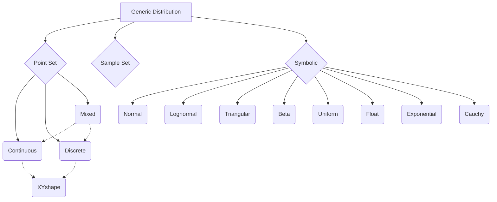

# Generic Distribution Library

This library provides one interface to generic distributions. These distributions can either be symbolic, point set (xy-coordinates of the shape), or sample set (arrays of random samples).

Different internal formats (symbolic, point set, sample set) allow for benefits and features. It's common for distributions to be converted into either point sets or sample sets to enable certain functions.

In addition to this interface, there's a second, generic function, for calling functions on this generic distribution type. This ``genericOperation`` standardizes the inputs and outputs for these various function calls. See it's ``run()`` function.

Performance is very important. Some operations can take a long time to run, and even then, be inaccurate. Because of this, we plan to have a lot of logging and stack tracing functionality eventually built in.

## Diagram of Distribution Types
